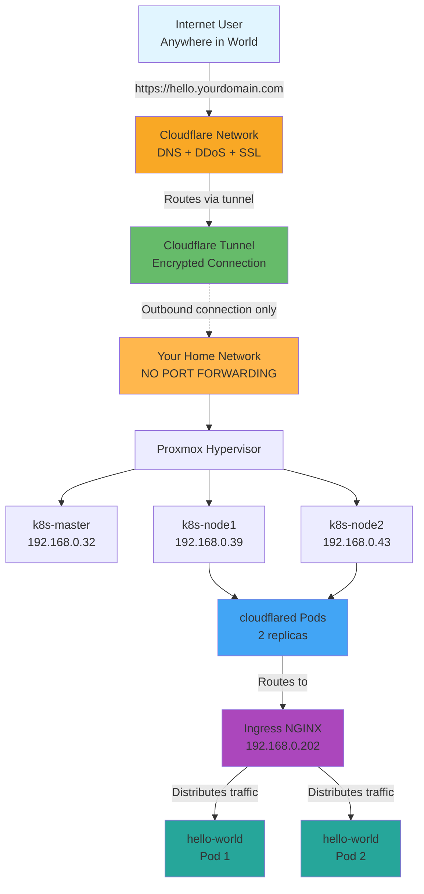
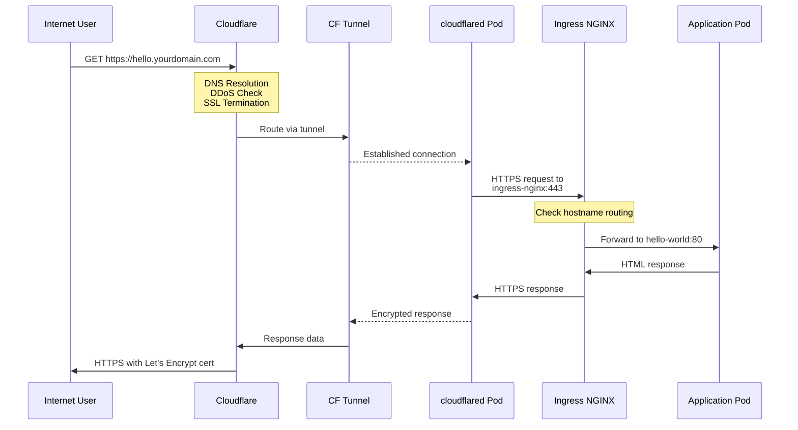

# Complete Kubernetes Home Lab with Internet Exposure

**Author:** Kenechi Dukor  
**Last Updated:** November 6, 2025  
**Version:** 2.0

**Platform:** Supermicro X10SLL-S (Intel Xeon E3-1225 v3, 16GB RAM, 2TB SSD, 160GB HDD)  
**Host OS:** Proxmox VE 9.0.3  
**Network:** 192.168.0.0/24 LAN  
**Internet Exposure:** Cloudflare Tunnel (no port forwarding required)

---

## Table of Contents

**Part I: Local Cluster Setup**
1. [System Overview](#1-system-overview)
2. [Proxmox Host Configuration](#2-proxmox-host-configuration)
3. [Kubernetes Cluster Setup](#3-kubernetes-cluster-setup)
4. [Network & Load Balancing Components](#4-network--load-balancing-components)
5. [Management & Monitoring Tools](#5-management--monitoring-tools)
6. [Deploying Applications Locally](#6-deploying-applications-locally)

**Part II: Internet Exposure**
7. [Exposing Services to the Internet](#7-exposing-services-to-the-internet)
8. [Deploy Your First Internet-Accessible App](#8-deploy-your-first-internet-accessible-app)

**Part III: Operations**
9. [Handy Operational Commands](#9-handy-operational-commands)
10. [Troubleshooting Guide](#10-troubleshooting-guide)
11. [Maintenance & Expansion](#11-maintenance--expansion)
12. [Summary](#12-summary)

---

# Part I: Local Cluster Setup

## 1. System Overview

This home-lab environment uses Proxmox VE as the base hypervisor to host a Kubernetes cluster composed of three Ubuntu 24.04 VMs. The setup allows containerized services (APIs, dashboards, Nextcloud, etc.) to be deployed in a production-like, reproducible environment.

### Cluster Nodes

| Node | Role | IP Address | vCPU | Memory |
|------|------|------------|------|--------|
| k8s-master | Control Plane | 192.168.0.32 | 2 | 3 GB |
| k8s-node1 | Worker Node | 192.168.0.39 | 2 | 4 GB |
| k8s-node2 | Worker Node | 192.168.0.45 | 2 | 4 GB |

Additional 160 GB HDD is mounted at `/mnt/pve/repo160` for repository and persistent storage.

---

## 2. Proxmox Host Configuration

### Install Proxmox VE

Install Proxmox VE 9.x on the 2 TB SSD.

### Create Ubuntu VMs

Create three Ubuntu 24.04 LTS VMs with these settings:

- Boot from `ubuntu-24.04.3-live-server-amd64.iso`
- Disk size: 30–40 GB each
- Enable EFI Disk and Cloud-Init if available
- Assign static IPs through `/etc/netplan/` or router DHCP reservation
- Enable bridge networking on Proxmox (usually `vmbr0`) to give each VM LAN access
- **⚠️ CRITICAL: During Ubuntu installation, DO NOT create a swap partition**

---

## 3. Kubernetes Cluster Setup

### ⚠️ CRITICAL Prerequisites

Before installing Kubernetes on **each node**, you MUST:

**1. Disable Swap (REQUIRED)**

Kubernetes does not support swap. If swap is enabled, kubelet will fail to start and pods will crash randomly.

```bash
# Disable swap immediately
sudo swapoff -a

# Prevent swap from re-enabling on reboot
sudo sed -i '/ swap / s/^\(.*\)$/#\1/g' /etc/fstab

# Verify swap is disabled (should show 0B)
free -h
```

**2. Enable IP Forwarding (REQUIRED)**

```bash
# Enable IP forwarding
sudo sysctl -w net.ipv4.ip_forward=1

# Make it permanent
echo "net.ipv4.ip_forward=1" | sudo tee -a /etc/sysctl.conf

# Verify (should show 1)
cat /proc/sys/net/ipv4/ip_forward
```

### Install Base Components on All Nodes

Run these commands on **all three nodes** (k8s-master, k8s-node1, k8s-node2):

```bash
sudo apt update && sudo apt install -y apt-transport-https ca-certificates curl containerd
sudo curl -fsSLo /usr/share/keyrings/kubernetes-archive-keyring.gpg \
  https://pkgs.k8s.io/core:/stable:/v1.30/deb/Release.key
echo "deb [signed-by=/usr/share/keyrings/kubernetes-archive-keyring.gpg] \
  https://pkgs.k8s.io/core:/stable:/v1.30/deb/ /" | \
  sudo tee /etc/apt/sources.list.d/kubernetes.list
sudo apt update && sudo apt install -y kubelet kubeadm kubectl
sudo systemctl enable kubelet containerd
```

### Configure Containerd

Run on **all three nodes**:

```bash
sudo containerd config default | sudo tee /etc/containerd/config.toml >/dev/null
sudo sed -i 's/SystemdCgroup = false/SystemdCgroup = true/' /etc/containerd/config.toml
sudo systemctl restart containerd
```

### Initialize the Control Plane

On **k8s-master only**:

```bash
sudo kubeadm init --pod-network-cidr=10.244.0.0/16
```

Configure kubectl for the current user:

```bash
mkdir -p $HOME/.kube
sudo cp -i /etc/kubernetes/admin.conf $HOME/.kube/config
sudo chown $(id -u):$(id -g) $HOME/.kube/config
```

The output provides a join command for workers. **Copy this command** - it looks like:

```bash
kubeadm join 192.168.0.32:6443 --token <token> --discovery-token-ca-cert-hash sha256:<hash>
```

### Join Worker Nodes

Run the join command (with `sudo`) on **both k8s-node1 and k8s-node2**.

**If you get an IP forwarding error:**
```bash
# Enable IP forwarding and retry
sudo sysctl -w net.ipv4.ip_forward=1
echo "net.ipv4.ip_forward=1" | sudo tee -a /etc/sysctl.conf
```

**Verify cluster:**

```bash
kubectl get nodes
```

All nodes should appear, though they'll be "NotReady" until we install the network plugin.

---

## 4. Network & Load Balancing Components

### Flannel (CNI - Container Network Interface)

**Purpose:** Provides pod-to-pod networking overlay (10.244.0.0/16).

**Install:**

```bash
kubectl apply -f https://raw.githubusercontent.com/flannel-io/flannel/master/Documentation/kube-flannel.yml
```

**Verify:**

```bash
kubectl get pods -n kube-flannel -o wide
```

Wait until all Flannel pods show `Running`. Then check nodes:

```bash
kubectl get nodes
```

All nodes should now show `Ready`.

---

### MetalLB (Bare-Metal LoadBalancer)

**Purpose:** Enables LoadBalancer services on non-cloud clusters by assigning IPs from your LAN.

**Install:**

```bash
kubectl apply -f https://raw.githubusercontent.com/metallb/metallb/v0.13.12/config/manifests/metallb-native.yaml
```

**Create IP address pool:**

```bash
cat <<EOF | kubectl apply -f -
apiVersion: metallb.io/v1beta1
kind: IPAddressPool
metadata:
  namespace: metallb-system
  name: home-lan-pool
spec:
  addresses:
  - 192.168.0.200-192.168.0.250
---
apiVersion: metallb.io/v1beta1
kind: L2Advertisement
metadata:
  namespace: metallb-system
  name: home-lan-advert
spec:
  ipAddressPools:
  - home-lan-pool
EOF
```

Now any service of type `LoadBalancer` automatically gets a LAN IP (e.g., 192.168.0.201).

---

### Ingress NGINX

**Purpose:** Routes HTTP/HTTPS traffic to internal services using domain names.

**Install:**

```bash
kubectl apply -f https://raw.githubusercontent.com/kubernetes/ingress-nginx/main/deploy/static/provider/baremetal/deploy.yaml
```

**Verify:**

```bash
kubectl get pods -n ingress-nginx
kubectl get svc -n ingress-nginx
```

Note the EXTERNAL-IP assigned to `ingress-nginx-controller` (e.g., 192.168.0.202).

---

### Cert-Manager

**Purpose:** Automates SSL/TLS certificate management from Let's Encrypt.

**Install:**

```bash
kubectl apply -f https://github.com/cert-manager/cert-manager/releases/download/v1.15.0/cert-manager.yaml
```

**Verify:**

```bash
kubectl get pods -n cert-manager
```

Wait for all cert-manager pods to show `Running`.

---

## 5. Management & Monitoring Tools

### Portainer (Kubernetes GUI)

**Purpose:** Visual management of containers, pods, and volumes.

**Install:**

```bash
kubectl create namespace portainer
kubectl apply -n portainer -f https://downloads.portainer.io/ce2-20/portainer-k8s-nodeport.yaml
```

**Access:**

Get the NodePort assigned:

```bash
kubectl get svc -n portainer
```

Access via: `https://<any-node-ip>:<nodeport>` or `https://<MetalLB-IP>:9443`

Create admin user on first login.

---

### Persistent Storage (Optional)

Mount the 160 GB HDD and make it available for persistent volumes:

**Mount the disk:**

```bash
sudo mkdir -p /mnt/repo160
sudo mount /dev/sdb1 /mnt/repo160
```

**Create PV/PVC:**

```yaml
apiVersion: v1
kind: PersistentVolume
metadata:
  name: repo160-pv
spec:
  capacity:
    storage: 50Gi
  accessModes:
    - ReadWriteMany
  hostPath:
    path: /mnt/repo160
  persistentVolumeReclaimPolicy: Retain
---
apiVersion: v1
kind: PersistentVolumeClaim
metadata:
  name: repo160-pvc
spec:
  accessModes:
    - ReadWriteMany
  resources:
    requests:
      storage: 50Gi
```

Apply:

```bash
kubectl apply -f repo160-storage.yaml
```

---

## 6. Deploying Applications Locally

### Example: Simple NGINX Deployment

```bash
kubectl create deployment nginx --image=nginx
kubectl expose deployment nginx --port=80 --type=LoadBalancer
kubectl get svc nginx
```

MetalLB will assign an IP like `192.168.0.201`. Access via browser: `http://192.168.0.201`

---

# Part II: Internet Exposure

## 7. Exposing Services to the Internet

Now let's make your Kubernetes services accessible from anywhere on the internet using **Cloudflare Tunnel** - no port forwarding needed!

### Complete Architecture

```
Internet User
    ↓ Types: https://hello.yourdomain.com
    ↓
Cloudflare Network (104.21.x.x, 172.67.x.x)
    ├─ Resolves DNS
    ├─ Checks DDoS rules
    └─ Terminates SSL (public certificate)
    ↓
Cloudflare Tunnel (encrypted QUIC/WebSocket)
    ↓ Established connection (outbound from home)
    ↓
Your Home Network (192.168.0.0/24)
    ├─ NO ports opened
    ├─ NO port forwarding
    └─ Home IP hidden
    ↓
Proxmox VE → Kubernetes Cluster
    ↓
cloudflared Pods (2 replicas, 8 connections total)
    ↓ Routes to: ingress-nginx service
    ↓
Ingress NGINX (192.168.0.202:443)
    ├─ Checks hostname: hello.yourdomain.com
    ├─ TLS handshake (internal cert)
    └─ Routes to: hello-world service
    ↓
Application Pods (hello-world)
    └─ Returns: HTML response
```



### Traffic Flow

```
Internet User
    ↓ Types: https://hello.yourdomain.com
    ↓
Cloudflare Network (104.21.x.x, 172.67.x.x)
    ├─ Resolves DNS
    ├─ Checks DDoS rules
    └─ Terminates SSL (public certificate)
    ↓
Cloudflare Tunnel (encrypted WebSocket)
    ↓ Established connection (outbound from home)
    ↓
Your Home Network (192.168.0.0/24)
    ├─ NO ports opened
    ├─ NO port forwarding
    └─ Home IP hidden
    ↓
Proxmox VE → Kubernetes Cluster
    ↓
cloudflared Pods (2 replicas, 8 connections total)
    ↓ Routes to: https://ingress-nginx:443
    ↓
Ingress NGINX (192.168.0.202:443)
    ├─ Checks hostname: hello.yourdomain.com
    ├─ TLS handshake (internal cert)
    └─ Routes to: hello-world service
    ↓
Application Pods (hello-world)
    └─ Returns: HTML response
```

### Request-Response Sequence



### Component Roles

**Cloudflare:** Manages DNS, provides DDoS protection, terminates SSL for public traffic, and routes requests through the tunnel.

**cloudflared pods:** Maintain encrypted tunnel connection to Cloudflare (2 pods × 4 connections = 8 total). Automatically reconnect on failure.

**Ingress NGINX:** Routes HTTP/HTTPS traffic by hostname to the correct Kubernetes service. Handles internal SSL/TLS.

**Cert-Manager:** Automatically requests and renews SSL certificates from Let's Encrypt using HTTP-01 challenges.

**MetalLB:** Assigns real LAN IP addresses (from 192.168.0.200-250 pool) to LoadBalancer services.

**Flannel:** Provides pod-to-pod networking using VXLAN overlay network (10.244.0.0/16).

### Security Benefits

- **No exposed home IP:** Your public IP address never appears in DNS or traffic
- **No open ports:** Router firewall remains completely closed
- **Encrypted tunnel:** All traffic encrypted end-to-end via QUIC/WebSocket
- **DDoS protection:** Cloudflare filters malicious traffic before it reaches you
- **Automatic SSL:** Let's Encrypt certificates issued and renewed automatically
- **Outbound only:** Cluster initiates connection; no inbound connections accepted

---

### Prerequisites for Internet Exposure

Before starting, you need:

1. ✅ A domain name (e.g., from Namecheap - costs ~$10-15/year)
2. ✅ A free Cloudflare account (sign up at https://cloudflare.com)
3. ✅ Your Kubernetes cluster with Ingress NGINX and Cert-Manager installed ✅

---

### Step-by-Step Setup

#### Step 1: Transfer Domain DNS to Cloudflare (10 minutes)

**At Cloudflare:**
1. Log in to https://dash.cloudflare.com
2. Click **"Add a Site"**
3. Enter your domain: `yourdomain.com`
4. Select the **Free** plan
5. Copy the 2 nameservers shown (e.g., `ellis.ns.cloudflare.com`, `liv.ns.cloudflare.com`)

**At your domain registrar (Namecheap, GoDaddy, etc.):**
1. Find domain settings → Nameservers
2. Change to "Custom DNS"
3. Paste the 2 Cloudflare nameservers
4. Save

**Wait 5-30 minutes** for DNS propagation. Cloudflare will email you when active.

**Verify:**
```bash
nslookup -type=ns yourdomain.com
# Should show Cloudflare nameservers
```

---

#### Step 2: Create Cloudflare Tunnel (5 minutes)

1. In Cloudflare Dashboard, click **Zero Trust** (or go to https://one.dash.cloudflare.com)
2. Click **"Get started with a free plan"** if prompted
3. Navigate to **Networks** → **Tunnels**
4. Click **"Create a tunnel"**
5. Select **"Cloudflared"**
6. Name: `home-k8s-cluster`
7. Click **"Save tunnel"**
8. **Copy the token** shown (long string starting with `eyJ...`)
9. **Note the Tunnel ID** (shown in the URL or tunnel list - format: `xxxxxxxx-xxxx-xxxx-xxxx-xxxxxxxxxxxx`)
10. **Keep this browser tab open!**

---

#### Step 3: Deploy Cloudflared in Kubernetes (2 minutes)

```bash
# Create namespace
kubectl create namespace cloudflare

# Deploy cloudflared (replace YOUR_TOKEN with actual token from Step 2)
cat <<'EOF' | kubectl apply -f -
apiVersion: apps/v1
kind: Deployment
metadata:
  name: cloudflared
  namespace: cloudflare
spec:
  replicas: 2
  selector:
    matchLabels:
      app: cloudflared
  template:
    metadata:
      labels:
        app: cloudflared
    spec:
      containers:
      - name: cloudflared
        image: cloudflare/cloudflared:latest
        args:
        - tunnel
        - --no-autoupdate
        - run
        - --token
        - YOUR_TUNNEL_TOKEN_HERE
        resources:
          requests:
            memory: "128Mi"
            cpu: "100m"
          limits:
            memory: "256Mi"
            cpu: "200m"
EOF
```

**Verify:**
```bash
kubectl get pods -n cloudflare
# Should show 2 Running pods

kubectl logs -n cloudflare -l app=cloudflared --tail=10
# Look for: "INF Registered tunnel connection"
```

---

#### Step 4: Configure Tunnel Ingress Rules (3 minutes)

**In the Cloudflare browser tab:**

1. Go to **Networks** → **Tunnels** → **home-k8s-cluster**
2. Click **"Published application routes"** tab
3. Click **"+ Add a published application route"**
4. Fill in:
   - **Subdomain:** `*` (asterisk for wildcard)
   - **Domain:** `yourdomain.com` (select from dropdown)
   - **Path:** (leave blank)
   - **Service Type:** `HTTPS`
   - **Service URL:** `ingress-nginx-controller.ingress-nginx.svc.cluster.local:443`

5. Expand **"Additional application settings"**
6. Under **TLS**, toggle **"No TLS Verify"** to **ON**
7. Click **"Save"**

**⚠️ Important:** If you get a DNS conflict error, delete the route and proceed to Step 5 to create the DNS record manually.

---

#### Step 5: Create DNS Records (2 minutes)

**In Cloudflare Dashboard:**

1. Click your domain → **DNS** → **Records**
2. Click **"+ Add record"**
3. Create tunnel CNAME:
   - **Type:** `CNAME`
   - **Name:** `*` (wildcard)
   - **Target:** `<YOUR-TUNNEL-ID>.cfargotunnel.com` 
     - Replace `<YOUR-TUNNEL-ID>` with your actual tunnel ID from Step 2
     - Example: `7437b588-6db4-4d6c-a3b9-643072312ca8.cfargotunnel.com`
   - **Proxy status:** **ON** (orange cloud) ← **CRITICAL!**
   - **TTL:** Auto
4. Click **"Save"**

**Verify DNS:**
```bash
nslookup hello.yourdomain.com
# Should return Cloudflare IPs (104.21.x.x or 172.67.x.x)
```

**Note:** With Proxy ON, Cloudflare routes traffic through the tunnel. The manual CNAME approach is more reliable than automatic DNS creation.

---

#### Step 6: Create SSL Certificate Issuer (2 minutes)

```bash
cat <<'EOF' | kubectl apply -f -
apiVersion: cert-manager.io/v1
kind: ClusterIssuer
metadata:
  name: letsencrypt-prod
spec:
  acme:
    server: https://acme-v02.api.letsencrypt.org/directory
    email: your-email@example.com
    privateKeySecretRef:
      name: letsencrypt-prod
    solvers:
    - http01:
        ingress:
          class: nginx
EOF
```

**Replace** `your-email@example.com` with your actual email.

**Verify:**
```bash
kubectl get clusterissuer
# Should show: letsencrypt-prod   True
```

---

## 8. Deploy Your First Internet-Accessible App

```bash
cat <<'EOF' | kubectl apply -f -
apiVersion: apps/v1
kind: Deployment
metadata:
  name: hello-world
  namespace: default
spec:
  replicas: 2
  selector:
    matchLabels:
      app: hello-world
  template:
    metadata:
      labels:
        app: hello-world
    spec:
      containers:
      - name: hello
        image: nginxdemos/hello
        ports:
        - containerPort: 80
---
apiVersion: v1
kind: Service
metadata:
  name: hello-world
  namespace: default
spec:
  selector:
    app: hello-world
  ports:
  - port: 80
    targetPort: 80
---
apiVersion: networking.k8s.io/v1
kind: Ingress
metadata:
  name: hello-world
  namespace: default
  annotations:
    cert-manager.io/cluster-issuer: "letsencrypt-prod"
spec:
  ingressClassName: nginx
  tls:
  - hosts:
    - hello.yourdomain.com
    secretName: hello-world-tls
  rules:
  - host: hello.yourdomain.com
    http:
      paths:
      - path: /
        pathType: Prefix
        backend:
          service:
            name: hello-world
            port:
              number: 80
EOF
```

**Replace** `yourdomain.com` with your domain!

### Monitor Deployment

```bash
# Watch pods start
kubectl get pods -w
# Press Ctrl+C after Running

# Check certificate (takes 2-3 minutes)
kubectl get certificate

# Test from your cluster
kubectl run test --image=curlimages/curl -i --rm --restart=Never -- \
  curl -I https://hello.yourdomain.com
```

### Test from Internet

```bash
curl -I https://hello.yourdomain.com
# Should return: HTTP/2 200
```

Visit `https://hello.yourdomain.com` in your browser - you should see the hello world page! 🎉

---

# Part III: Operations

## 9. Handy Operational Commands

### Basic Operations

| Purpose | Command |
|---------|---------|
| List all pods | `kubectl get pods -A -o wide` |
| View logs | `kubectl logs <pod-name> -n <namespace>` |
| Follow logs | `kubectl logs <pod-name> -n <namespace> -f` |
| Describe pod | `kubectl describe pod <pod-name> -n <namespace>` |
| Check nodes | `kubectl get nodes -o wide` |
| Apply manifest | `kubectl apply -f <file>.yaml` |
| Delete manifest | `kubectl delete -f <file>.yaml` |
| SSH into pod | `kubectl exec -it <pod> -- /bin/bash` |

### Tunnel Management

```bash
# Check tunnel status
kubectl get pods -n cloudflare
kubectl logs -n cloudflare -l app=cloudflared -f

# Restart tunnel
kubectl rollout restart deployment cloudflared -n cloudflare
```

### Certificate Management

```bash
# View all certificates
kubectl get certificate -A

# Check certificate details
kubectl describe certificate <cert-name> -n <namespace>

# Check cert-manager logs
kubectl logs -n cert-manager -l app=cert-manager --tail=50
```

### Ingress & Services

```bash
# View all ingresses
kubectl get ingress -A

# Check Ingress NGINX logs
kubectl logs -n ingress-nginx -l app.kubernetes.io/component=controller --tail=100

# Test internal connectivity
kubectl run test --image=curlimages/curl -i --rm --restart=Never -- \
  curl -Ik https://ingress-nginx-controller.ingress-nginx.svc.cluster.local:443
```

---

## 10. Troubleshooting Guide

### Issue: Node Shows "NotReady" or Pods Keep Crashing

**Cause:** Swap is enabled (most common issue)

**Symptoms:**
- Nodes show "NotReady" status
- Pods in CrashLoopBackOff
- kubelet service fails to start
- Pods start then exit after 1-2 minutes

**Check:**
```bash
# On the problematic node
free -h
# If swap shows anything other than 0B, swap is enabled
```

**Fix:**
```bash
# SSH to the problematic node
ssh user@node-ip

# Disable swap immediately
sudo swapoff -a

# Prevent swap from re-enabling
sudo sed -i '/ swap / s/^\(.*\)$/#\1/g' /etc/fstab

# Verify swap is disabled
free -h
# Should show: Swap: 0B 0B 0B

# Restart kubelet
sudo systemctl restart kubelet

# Check kubelet status
sudo systemctl status kubelet
```

**Prevention:** Always disable swap during initial Ubuntu installation or immediately after VM creation.

---

### Issue: kubeadm join fails with "IP forwarding" error

**Error message:** `ERROR FileContent--proc-sys-net-ipv4-ip_forward`

**Fix:**
```bash
# Enable IP forwarding
sudo sysctl -w net.ipv4.ip_forward=1

# Make permanent
echo "net.ipv4.ip_forward=1" | sudo tee -a /etc/sysctl.conf

# Retry join command
sudo kubeadm join ...
```

---

### Issue: Tunnel Shows "Down" or "Unhealthy"

**Check:**
```bash
kubectl get pods -n cloudflare
kubectl logs -n cloudflare -l app=cloudflared --tail=50
```

**Look for:** "INF Registered tunnel connection" messages

**Common fixes:**
- Wrong token → Redeploy with correct token
- Restart tunnel: `kubectl rollout restart deployment cloudflared -n cloudflare`
- Check cluster DNS: `kubectl get pods -n kube-system -l k8s-app=kube-dns`

---

### Issue: Error 522 (Connection timeout)

**Cause:** Cloudflare tunnel can't reach Ingress NGINX

**Check:**
```bash
# Is Ingress running?
kubectl get pods -n ingress-nginx
kubectl get svc -n ingress-nginx

# Test if pods can reach the service
kubectl run test --image=curlimages/curl -i --rm --restart=Never -- \
  curl -Ik https://ingress-nginx-controller.ingress-nginx.svc.cluster.local:443
# Should return: HTTP/2 (any status code means connectivity works)
```

**Common causes:**
- Published application route has wrong URL
- DNS CNAME not created or pointing to wrong tunnel ID
- "No TLS Verify" not enabled in tunnel config

**Fix:**
1. Verify tunnel configuration shows: `ingress-nginx-controller.ingress-nginx.svc.cluster.local:443`
2. Verify DNS CNAME points to: `<tunnel-id>.cfargotunnel.com`
3. Verify Proxy status is ON (orange cloud)
4. Check tunnel logs for connection errors

---

### Issue: "Could not resolve host"

**Cause:** DNS record missing or not proxied

**Fix:**
1. Go to Cloudflare → DNS → Records
2. Verify CNAME `*` exists
3. Target should be: `<your-tunnel-id>.cfargotunnel.com`
4. Verify **Proxy status is ON** (orange cloud)
5. Wait 2-5 minutes for DNS propagation

**Test DNS:**
```bash
nslookup hello.yourdomain.com
# Should return Cloudflare IPs (104.21.x.x or 172.67.x.x)
```

---

### Issue: Certificate Not Ready

**Check:**
```bash
kubectl describe certificate hello-world-tls -n default
kubectl logs -n cert-manager -l app=cert-manager --tail=50
```

**Common causes:**
- DNS not resolving yet (wait 2-3 minutes)
- ClusterIssuer misconfigured
- Let's Encrypt rate limits (5 per week for same domain)
- Ingress not properly configured

**Fix:**
```bash
# Delete and recreate certificate
kubectl delete certificate hello-world-tls -n default

# Delete and recreate ingress (this triggers new cert request)
kubectl delete ingress hello-world -n default
# Then reapply your ingress manifest

# Watch certificate creation
kubectl get certificate -w
```

---

### Complete Troubleshooting Table

| Symptom | Cause | Fix |
|---------|-------|-----|
| Node NotReady, pods crashing | Swap enabled | Disable swap with `swapoff -a` |
| kubeadm join fails | IP forwarding disabled | `sysctl -w net.ipv4.ip_forward=1` |
| Tunnel shows "Down" | cloudflared not connecting | Check logs, verify token, restart |
| Error 522 | Tunnel can't reach Ingress | Verify service URL and No TLS Verify |
| Could not resolve host | Missing/wrong DNS record | Create CNAME with Proxy ON |
| Certificate not ready | DNS propagation | Wait 2-3 min, check cert-manager logs |
| Pods in CrashLoopBackOff | Check pod logs | `kubectl logs <pod> --previous` |
| Service has no EXTERNAL-IP | MetalLB not configured | Check MetalLB pods and IPAddressPool |

---

## 11. Maintenance & Expansion

### Backups

**Proxmox snapshots:**
```bash
# On Proxmox host
qm snapshot <VMID> backup-$(date +%Y%m%d)
```

**etcd backup (cluster state):**
```bash
# On k8s-master
sudo ETCDCTL_API=3 etcdctl \
  --endpoints=https://127.0.0.1:2379 \
  --cacert=/etc/kubernetes/pki/etcd/ca.crt \
  --cert=/etc/kubernetes/pki/etcd/server.crt \
  --key=/etc/kubernetes/pki/etcd/server.key \
  snapshot save /backup/etcd-snapshot-$(date +%Y%m%d).db
```

### Scaling

**Add worker nodes:**
1. Create new VM in Proxmox
2. Install Ubuntu 24.04 **without swap**
3. Enable IP forwarding
4. Install Kubernetes components (Section 3)
5. Generate join token on master: `kubeadm token create --print-join-command`
6. Run join command on new node
7. Verify: `kubectl get nodes`

### Updates

**Update packages on nodes:**
```bash
sudo apt update && sudo apt upgrade -y
```

**Check Kubernetes version:**
```bash
kubectl version --short
```

**Plan Kubernetes upgrade:**
```bash
sudo kubeadm upgrade plan
```

### Deploy Additional Services

Once hello-world works, deploy more apps:

```bash
# Create deployment
kubectl create deployment myapp --image=your-image

# Expose as service
kubectl expose deployment myapp --port=80

# Create ingress
cat <<EOF | kubectl apply -f -
apiVersion: networking.k8s.io/v1
kind: Ingress
metadata:
  name: myapp
  annotations:
    cert-manager.io/cluster-issuer: "letsencrypt-prod"
spec:
  ingressClassName: nginx
  tls:
  - hosts:
    - myapp.yourdomain.com
    secretName: myapp-tls
  rules:
  - host: myapp.yourdomain.com
    http:
      paths:
      - path: /
        pathType: Prefix
        backend:
          service:
            name: myapp
            port:
              number: 80
EOF
```

Result: `https://myapp.yourdomain.com` works automatically! 🚀

---

## 12. Summary

### What You've Built

✅ **Local Kubernetes cluster** on Proxmox with 3 nodes  
✅ **Network infrastructure:** Flannel, MetalLB, Ingress NGINX  
✅ **Certificate automation:** Cert-Manager with Let's Encrypt  
✅ **Internet exposure:** Cloudflare Tunnel (no port forwarding)  
✅ **Automatic SSL:** Every service gets HTTPS automatically  
✅ **Management GUI:** Portainer for visual administration  
✅ **Persistent storage:** 160GB HDD for stateful apps  

### Capabilities

**Local:**
- Multi-node orchestration with automatic failover
- Real LAN IP load balancing via MetalLB
- Persistent storage for stateful applications
- GUI management via Portainer

**Internet:**
- Services accessible worldwide via Cloudflare Tunnel
- Automatic SSL certificates from Let's Encrypt
- Free DDoS protection and CDN from Cloudflare
- Hidden home IP, no exposed ports
- Professional-grade security

### Cost

| Item | Cost |
|------|------|
| Domain | ~$12/year |
| Cloudflare | $0 |
| SSL Certificates | $0 |
| Hardware | Already owned |
| **Total** | **~$1/month** |

### Critical Success Factors

The following are **essential** for cluster stability:

1. ⚠️ **Swap must be disabled** on all nodes (most common failure point)
2. ⚠️ **IP forwarding must be enabled** on all nodes
3. ⚠️ **Cloudflare tunnel DNS must use manual CNAME** (more reliable than auto-creation)
4. ⚠️ **"No TLS Verify" must be enabled** in Cloudflare tunnel configuration

### Next Steps

- Deploy your own applications
- Add monitoring (Prometheus/Grafana)
- Set up CI/CD pipelines
- Implement automated backups
- Experiment with different workloads
- Add more worker nodes as needed

---

## Lessons Learned

During the development of this lab, several critical issues were discovered and resolved:

1. **Swap causes random pod failures** - Kubernetes requires swap to be completely disabled. Even with swap configured, pods will start successfully but crash after 1-2 minutes with no clear error messages. This was the root cause of persistent node2 instability.

2. **IP forwarding must be enabled** - kubeadm will fail to join nodes if IP forwarding is not enabled in the kernel.

3. **Cloudflare auto-DNS is unreliable** - The "Published application routes" feature sometimes fails to create DNS records automatically, especially with wildcard hostnames. Manually creating a CNAME record pointing to `<tunnel-id>.cfargotunnel.com` is more reliable.

4. **ClusterIP routing requires working kube-proxy** - If pods can reach services via pod IP but not via ClusterIP, check that kube-proxy is running on all nodes.

5. **Fresh VM solves persistent issues** - When a node experiences repeated failures despite fixes, recreating the VM from scratch (with proper configuration) is often faster than troubleshooting deep system issues.

---

**You now have enterprise-grade infrastructure that rivals cloud providers, running at home, under your complete control, for almost no cost.**

**Deploy like Heroku. Run at home. Pay almost nothing.** 🚀

---

**Author:** Kenechi Dukor  
**© 2025** | Free to use and share with attribution  

**Version History:**
- v2.0 (Nov 6, 2025): Added critical swap warnings, IP forwarding requirements, manual DNS approach, enhanced troubleshooting
- v1.0 (Nov 2025): Initial release

**End of Document**
