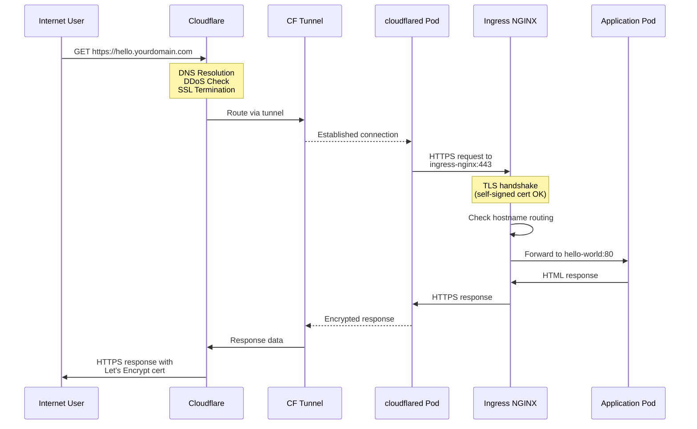

# 🧠 Complete Kubernetes Home Lab Guide with Internet Exposure

**Author:** Kenechi Dukor  
**Last Updated:** November 2025

This comprehensive guide walks you through building a production-grade Kubernetes cluster on Proxmox and exposing services to the internet securely using Cloudflare Tunnel.

**System:** Supermicro X10SLL-S | Proxmox VE 9.0.3 | 3-Node K8s Cluster  
**Method:** Zero port forwarding, hidden home IP, free DDoS protection

---

## 📚 Quick Navigation

- [Prerequisites & Hardware](#prerequisites)
- [Basic Cluster Setup (Sections 1-7)](#basic-kubernetes-cluster)
- [**Internet Exposure Setup (Section 8)**](#exposing-to-the-internet)
- [Troubleshooting Guide](#troubleshooting)
- [Command Reference](#useful-commands)

---

## Prerequisites

**Hardware:**
- Server: Supermicro X10SLL-S (or similar)
- CPU: Intel Xeon E3-1225 v3 (or equivalent)
- RAM: 16GB minimum
- Storage: 2TB SSD + optional 160GB HDD

**Software:**
- Proxmox VE 9.x installed
- Ubuntu 24.04 LTS ISO
- Domain name (~$10-15/year)
- Free Cloudflare account

---

## Basic Kubernetes Cluster

### Cluster Nodes

| Node | Role | IP | vCPU | RAM |
|------|------|-----|------|-----|
| k8s-master | Control Plane | 192.168.0.32 | 2 | 3GB |
| k8s-node1 | Worker | 192.168.0.39 | 2 | 4GB |
| k8s-node2 | Worker | 192.168.0.43 | 2 | 4GB |

For detailed cluster setup (Proxmox VMs, Kubernetes installation, Flannel, MetalLB, Ingress NGINX, Cert-Manager), refer to sections 1-7 in the full documentation. This section focuses on **internet exposure**.

---

## Exposing to the Internet

### 🏗️ Complete Architecture Diagram


### 📊 Detailed Network Flow

```
┌─────────────────────────────────────────────────────────────┐
│                    INTERNET USER                             │
│                                                              │
│  Browser: https://hello.yourdomain.com                      │
└────────────────────────┬────────────────────────────────────┘
                         │
                         ▼
┌─────────────────────────────────────────────────────────────┐
│              CLOUDFLARE GLOBAL NETWORK                       │
│                                                              │
│  ┌────────────┐  ┌──────────────┐  ┌─────────────────┐    │
│  │    DNS     │  │     DDoS     │  │  SSL Termination│    │
│  │ Resolution │  │  Protection  │  │  & Certificates │    │
│  └────────────┘  └──────────────┘  └─────────────────┘    │
│                                                              │
│  Resolves to Cloudflare IPs: 104.21.x.x, 172.67.x.x        │
└────────────────────────┬────────────────────────────────────┘
                         │
                         ▼
┌─────────────────────────────────────────────────────────────┐
│                 CLOUDFLARE TUNNEL                            │
│                                                              │
│  Encrypted WebSocket connection (outbound from your home)   │
│  Protocol: QUIC (UDP) or HTTP/2                             │
│  Status: Healthy (4 connections per pod)                    │
└────────────────────────┬────────────────────────────────────┘
                         │
                         ▼
┌─────────────────────────────────────────────────────────────┐
│                  YOUR HOME NETWORK                           │
│                  192.168.0.0/24 LAN                          │
│                                                              │
│  ✓ No ports opened on router                                │
│  ✓ No port forwarding configured                            │
│  ✓ Home IP address hidden from internet                     │
│  ✓ Works behind any firewall/NAT/ISP                        │
└────────────────────────┬────────────────────────────────────┘
                         │
                         ▼
┌─────────────────────────────────────────────────────────────┐
│              PROXMOX HYPERVISOR                              │
│              Supermicro X10SLL-S                             │
│                                                              │
│  CPU: Intel Xeon E3-1225 v3                                 │
│  RAM: 16 GB                                                  │
│  Storage: 2 TB SSD + 160 GB HDD                             │
└──────────┬──────────────────┬────────────────┬──────────────┘
           │                  │                │
           ▼                  ▼                ▼
   ┌───────────────┐  ┌───────────────┐  ┌───────────────┐
   │  k8s-master   │  │  k8s-node1    │  │  k8s-node2    │
   │  192.168.0.32 │  │  192.168.0.39 │  │  192.168.0.43 │
   │               │  │               │  │               │
   │  Control      │  │  Worker       │  │  Worker       │
   │  Plane        │  │  Node         │  │  Node         │
   │               │  │               │  │               │
   │  2 vCPU       │  │  2 vCPU       │  │  2 vCPU       │
   │  3 GB RAM     │  │  4 GB RAM     │  │  4 GB RAM     │
   └───────────────┘  └───────┬───────┘  └───────┬───────┘
                              │                   │
                              ▼                   ▼
                    ┌─────────────────────────────────┐
                    │    cloudflared Pods (2x)        │
                    │                                 │
                    │  ┌──────────────────────────┐  │
                    │  │ cloudflared-xxx-pod1     │  │
                    │  │ Maintains 4 connections  │  │
                    │  └──────────────────────────┘  │
                    │  ┌──────────────────────────┐  │
                    │  │ cloudflared-xxx-pod2     │  │
                    │  │ Maintains 4 connections  │  │
                    │  └──────────────────────────┘  │
                    └─────────────┬───────────────────┘
                                  │
                                  ▼
                    ┌─────────────────────────────────┐
                    │      Ingress NGINX               │
                    │      192.168.0.202:443           │
                    │                                  │
                    │  ┌────────────────────────────┐ │
                    │  │  Route by hostname:        │ │
                    │  │                            │ │
                    │  │  hello.yourdomain.com →   │ │
                    │  │    hello-world service     │ │
                    │  │                            │ │
                    │  │  api.yourdomain.com →     │ │
                    │  │    api service             │ │
                    │  └────────────────────────────┘ │
                    └─────────────┬───────────────────┘
                                  │
                 ┌────────────────┴─────────────────┐
                 │                                  │
                 ▼                                  ▼
       ┌──────────────────┐              ┌──────────────────┐
       │  hello-world     │              │  hello-world     │
       │  Pod 1           │              │  Pod 2           │
       │                  │              │                  │
       │  10.244.1.x:80   │              │  10.244.2.x:80   │
       │                  │              │                  │
       │  nginxdemos/hello│              │  nginxdemos/hello│
       └──────────────────┘              └──────────────────┘
```

### 🔄 Request Flow Sequence



### 🧩 Component Responsibilities

```
┌─────────────────────────────────────────────────────────────┐
│                    COMPONENT ROLES                           │
└─────────────────────────────────────────────────────────────┘

┌──────────────────┐
│   Cloudflare     │  • DNS management (resolve domain names)
│   (Edge)         │  • DDoS protection (filter malicious traffic)
│                  │  • SSL/TLS termination (manage public certs)
│                  │  • CDN/Caching (speed up content delivery)
│                  │  • Web Application Firewall (WAF)
└──────────────────┘

┌──────────────────┐
│  cloudflared     │  • Maintain tunnel connection (8 total)
│  (Pods in K8s)   │  • Automatic reconnection on failure
│                  │  • Load balance across connections
│                  │  • Health monitoring (metrics on :2000)
└──────────────────┘

┌──────────────────┐
│  Ingress NGINX   │  • HTTP/HTTPS routing by hostname
│  (LoadBalancer)  │  • Backend health checks
│                  │  • Load balancing to pods
│                  │  • SSL/TLS for internal traffic
│                  │  • Request logging and metrics
└──────────────────┘

┌──────────────────┐
│  Cert-Manager    │  • Request SSL certs from Let's Encrypt
│  (Controller)    │  • Automatic renewal (before expiry)
│                  │  • DNS-01 or HTTP-01 challenges
│                  │  • Certificate storage in secrets
└──────────────────┘

┌──────────────────┐
│  MetalLB         │  • Assign real LAN IPs to LoadBalancers
│  (Controller)    │  • L2 advertisement (ARP responses)
│                  │  • IP pool management
│                  │  • Failover between nodes
└──────────────────┘

┌──────────────────┐
│  Flannel         │  • Pod-to-pod networking (VXLAN overlay)
│  (CNI)           │  • IP address management (10.244.0.0/16)
│                  │  • Cross-node communication
│                  │  • Network policy enforcement
└──────────────────┘
```

### 🔐 Security Layers

```
┌─────────────────────────────────────────────────────────────┐
│                    SECURITY LAYERS                           │
└─────────────────────────────────────────────────────────────┘

Layer 7 (Application)
    ├─ Cloudflare WAF (Web Application Firewall)
    ├─ Rate limiting (protect from abuse)
    └─ Bot detection (block malicious bots)

Layer 6 (Presentation)  
    ├─ SSL/TLS encryption (end-to-end)
    ├─ Certificate validation (Let's Encrypt)
    └─ HTTPS enforcement (no HTTP allowed)

Layer 4 (Transport)
    ├─ Cloudflare Tunnel (encrypted WebSocket)
    ├─ QUIC protocol (UDP with TLS)
    └─ Connection authentication (tunnel token)

Layer 3 (Network)
    ├─ No exposed public IP (outbound only)
    ├─ No open ports on router (zero attack surface)
    ├─ Flannel network policies (pod isolation)
    └─ Private cluster network (10.244.0.0/16)

Layer 2 (Data Link)
    ├─ Proxmox firewall (VM isolation)
    ├─ Bridge networking (vmbr0)
    └─ VLAN support (if configured)

Layer 1 (Physical)
    ├─ On-premises hardware (full control)
    └─ Network segmentation (management vs. data)
```

---

### 📈 Scaling & High Availability

```
Current Setup (Basic):
┌────────────────────────────────────┐
│  2 cloudflared pods (4 conn each)  │
│  1 Ingress NGINX instance          │
│  2 Application pods per service    │
└────────────────────────────────────┘

Production Setup (Recommended):
┌────────────────────────────────────┐
│  3+ cloudflared pods (12+ conns)   │
│  2+ Ingress NGINX instances (HA)   │
│  3+ Application pods (with HPA)    │
│  PodDisruptionBudgets configured   │
│  Node affinity for spread          │
└────────────────────────────────────┘

Enterprise Setup:
┌────────────────────────────────────┐
│  5+ cloudflared pods across zones  │
│  3+ Ingress with circuit breakers  │
│  Auto-scaling (HPA + VPA)          │
│  Multi-cluster federation          │
│  Disaster recovery automation      │
│  Full observability stack          │
└────────────────────────────────────┘
```

---

### Step 1: Transfer Domain to Cloudflare DNS

**Time: 10 minutes**

1. **At Cloudflare** (https://dash.cloudflare.com):
   - Click "Add a Site"
   - Enter `yourdomain.com`
   - Choose **Free** plan
   - Copy the 2 nameservers shown (e.g., `ellis.ns.cloudflare.com`)

2. **At your domain registrar** (Namecheap, GoDaddy, etc.):
   - Find domain settings
   - Change nameservers to Cloudflare's
   - Save

3. **Wait 5-30 minutes** for DNS propagation

**Verify:**
```bash
nslookup -type=ns yourdomain.com
# Should show Cloudflare nameservers
```

---

### Step 2: Create Cloudflare Tunnel

**Time: 5 minutes**

1. In Cloudflare Dashboard → **Zero Trust** (or https://one.dash.cloudflare.com)
2. **Networks** → **Tunnels**
3. Click **Create a tunnel**
4. Select **Cloudflared**
5. Name: `home-k8s-cluster`
6. Click **Save tunnel**
7. **Copy the token** shown (long string starting with `eyJ...`)
8. **Keep this browser tab open!**

---

### Step 3: Deploy Cloudflared in Kubernetes

**Time: 2 minutes**

```bash
# Create namespace
kubectl create namespace cloudflare

# Deploy cloudflared (replace YOUR_TOKEN with actual token)
cat <<'EOF' | kubectl apply -f -
apiVersion: apps/v1
kind: Deployment
metadata:
  name: cloudflared
  namespace: cloudflare
spec:
  replicas: 2
  selector:
    matchLabels:
      app: cloudflared
  template:
    metadata:
      labels:
        app: cloudflared
    spec:
      containers:
      - name: cloudflared
        image: cloudflare/cloudflared:latest
        args:
        - tunnel
        - --no-autoupdate
        - run
        - --token
        - YOUR_TUNNEL_TOKEN_HERE
        resources:
          requests:
            memory: "128Mi"
            cpu: "100m"
          limits:
            memory: "256Mi"
            cpu: "500m"
EOF
```

**Verify deployment:**
```bash
kubectl get pods -n cloudflare
# Should show 2 Running pods

kubectl logs -n cloudflare -l app=cloudflared --tail=20
# Look for: "INF Registered tunnel connection"
```

---

### Step 4: Configure Tunnel Route

**Time: 3 minutes**

**In the Cloudflare browser tab:**

1. Go to **Published application routes** tab
2. Click **Add a public hostname**
3. Fill in:
   - **Subdomain:** `*` (asterisk for wildcard)
   - **Domain:** `yourdomain.com` (select from dropdown)
   - **Path:** (leave blank)
   - **Service Type:** `HTTPS`
   - **Service URL:** `ingress-nginx-controller.ingress-nginx.svc.cluster.local:443`

4. Click **Additional application settings** (expand)
5. Under **TLS**, toggle **No TLS Verify** to **ON**
6. Click **Save hostname**

**Verify:**
- Go to **Networks** → **Tunnels**
- Status should be **"Healthy"** (green)
- If "Down", wait 2 minutes and refresh

---

### Step 5: Create SSL Certificate Issuer

**Time: 2 minutes**

```bash
cat <<'EOF' | kubectl apply -f -
apiVersion: cert-manager.io/v1
kind: ClusterIssuer
metadata:
  name: letsencrypt-prod
spec:
  acme:
    server: https://acme-v02.api.letsencrypt.org/directory
    email: your-email@example.com
    privateKeySecretRef:
      name: letsencrypt-prod
    solvers:
    - http01:
        ingress:
          class: nginx
EOF
```

**Replace** `your-email@example.com` with your actual email.

**Verify:**
```bash
kubectl get clusterissuer
# Should show: letsencrypt-prod   True
```

---

### Step 6: Create DNS Records

**Time: 2 minutes**

**In Cloudflare Dashboard:**

1. Click your domain → **DNS** → **Records**
2. Click **Add record**
3. Create wildcard:
   - **Type:** `A`
   - **Name:** `*`
   - **IPv4 address:** `192.0.2.1` (dummy IP)
   - **Proxy status:** **ON** (orange cloud) ← **CRITICAL!**
   - **TTL:** Auto
4. Click **Save**

**Why dummy IP?** With Proxy ON, Cloudflare routes through the tunnel and ignores the IP.

---

### Deploy Your First Internet-Accessible App

**Time: 3 minutes**

```bash
cat <<'EOF' | kubectl apply -f -
apiVersion: apps/v1
kind: Deployment
metadata:
  name: hello-world
  namespace: default
spec:
  replicas: 2
  selector:
    matchLabels:
      app: hello-world
  template:
    metadata:
      labels:
        app: hello-world
    spec:
      containers:
      - name: hello
        image: nginxdemos/hello
        ports:
        - containerPort: 80
---
apiVersion: v1
kind: Service
metadata:
  name: hello-world
  namespace: default
spec:
  selector:
    app: hello-world
  ports:
  - port: 80
    targetPort: 80
---
apiVersion: networking.k8s.io/v1
kind: Ingress
metadata:
  name: hello-world
  namespace: default
  annotations:
    cert-manager.io/cluster-issuer: "letsencrypt-prod"
spec:
  ingressClassName: nginx
  tls:
  - hosts:
    - hello.yourdomain.com
    secretName: hello-world-tls
  rules:
  - host: hello.yourdomain.com
    http:
      paths:
      - path: /
        pathType: Prefix
        backend:
          service:
            name: hello-world
            port:
              number: 80
EOF
```

**Replace** `yourdomain.com` with your domain!

**Monitor deployment:**
```bash
# Watch pods start
kubectl get pods -w

# Check certificate (takes 2-3 minutes)
kubectl get certificate

# Test DNS
nslookup hello.yourdomain.com
# Should return Cloudflare IPs (104.x or 172.x)

# Test in browser
curl https://hello.yourdomain.com
```

**Success!** Your app is now accessible worldwide at `https://hello.yourdomain.com` 🎉

---

## Troubleshooting

### Issue: Tunnel shows "Down"

**Check:**
```bash
kubectl get pods -n cloudflare
kubectl logs -n cloudflare -l app=cloudflared --tail=50
```

**Look for:** "Registered tunnel connection" messages

**Common fixes:**
- Wrong token → Redeploy with correct token
- Network issues → Check if pods can reach internet:
  ```bash
  kubectl exec -n cloudflare deployment/cloudflared -- wget -O- https://1.1.1.1
  ```
- Restart tunnel:
  ```bash
  kubectl rollout restart deployment cloudflared -n cloudflare
  ```

---

### Issue: "Could not resolve host"

**Cause:** DNS record missing or not proxied

**Fix:**
1. Go to Cloudflare → DNS → Records
2. Verify wildcard `*` exists
3. Verify **Proxy status is ON** (orange cloud, not gray)
4. Wait 5 minutes for propagation

---

### Issue: Error 522 (Connection timeout)

**Cause:** Tunnel can't reach Ingress NGINX

**Check:**
```bash
# Is Ingress running?
kubectl get pods -n ingress-nginx
kubectl get svc -n ingress-nginx

# Test internal connectivity
kubectl run test --image=curlimages/curl -i --rm --restart=Never -- \
  curl -Ik -H "Host: hello.yourdomain.com" \
  https://ingress-nginx-controller.ingress-nginx.svc.cluster.local:443
# Should return: HTTP/2 200
```

**Common fixes:**
- Wrong service URL in tunnel config
- Ingress NGINX not listening on 443
- Application pods not running

**Verify tunnel route:**
- Cloudflare → Zero Trust → Tunnels → Your tunnel
- Check URL is: `https://ingress-nginx-controller.ingress-nginx.svc.cluster.local:443`
- Verify "No TLS Verify" is ON

---

### Issue: Certificate not issuing

```bash
kubectl describe certificate hello-world-tls -n default
kubectl logs -n cert-manager -l app=cert-manager --tail=50
```

**Common causes:**
- DNS not resolving yet
- ClusterIssuer misconfigured
- Rate limits from Let's Encrypt

**Fix:**
```bash
# Delete and recreate
kubectl delete certificate hello-world-tls -n default
kubectl delete ingress hello-world -n default
# Then reapply manifest
```

---

## Useful Commands

### Tunnel Management
```bash
# Check tunnel status
kubectl get pods -n cloudflare
kubectl logs -n cloudflare -l app=cloudflared -f

# Restart tunnel
kubectl rollout restart deployment cloudflared -n cloudflare

# Delete and redeploy tunnel
kubectl delete deployment cloudflared -n cloudflare
# Then redeploy with kubectl apply
```

### Application Management
```bash
# View all internet-facing services
kubectl get ingress -A

# Check SSL certificates
kubectl get certificate -A

# View specific certificate details
kubectl describe certificate <name> -n <namespace>

# Test internal connectivity
kubectl run test --image=curlimages/curl -i --rm --restart=Never -- \
  curl -Ik https://ingress-nginx-controller.ingress-nginx.svc.cluster.local:443

# Check DNS from cluster
kubectl run dns-test --image=busybox -i --rm --restart=Never -- \
  nslookup hello.yourdomain.com
```

### Debugging
```bash
# View Ingress NGINX logs
kubectl logs -n ingress-nginx -l app.kubernetes.io/component=controller --tail=100

# Check cert-manager logs
kubectl logs -n cert-manager -l app=cert-manager --tail=50

# View all resources
kubectl get all -n <namespace>

# Describe pod for detailed info
kubectl describe pod <pod-name> -n <namespace>

# Get events
kubectl get events -n <namespace> --sort-by='.lastTimestamp'
```

---

## Deploy Additional Services

Once your first app works, adding more is trivial:

```bash
# Deploy second app
kubectl create deployment nginx-app --image=nginx
kubectl expose deployment nginx-app --port=80

# Create ingress
cat <<'EOF' | kubectl apply -f -
apiVersion: networking.k8s.io/v1
kind: Ingress
metadata:
  name: nginx-app
  namespace: default
  annotations:
    cert-manager.io/cluster-issuer: "letsencrypt-prod"
spec:
  ingressClassName: nginx
  tls:
  - hosts:
    - app.yourdomain.com
    secretName: nginx-app-tls
  rules:
  - host: app.yourdomain.com
    http:
      paths:
      - path: /
        pathType: Prefix
        backend:
          service:
            name: nginx-app
            port:
              number: 80
EOF
```

**Result:** `https://app.yourdomain.com` works in 2-3 minutes! 🚀

---

## Complete Troubleshooting Table

| Symptom | Cause | Fix |
|---------|-------|-----|
| Tunnel shows "Down" | cloudflared not connecting | Check logs, restart deployment |
| Error 522 | Tunnel can't reach Ingress | Verify tunnel URL and Ingress status |
| Could not resolve host | Missing/wrong DNS record | Add A record with Proxy ON (orange) |
| Certificate not ready | DNS not propagating | Wait 2-3 minutes, check cert-manager logs |
| ErrImagePull | Image not accessible | Use public image or check registry |
| CrashLoopBackOff | App crashing | Check pod logs |
| Node NotReady | Flannel down | Restart Flannel pods |
| No external IP on service | MetalLB issue | Check MetalLB configuration |

---

## Best Practices

1. **Always use HTTPS** - Never expose HTTP to internet
2. **Monitor tunnel health** - Check cloudflared logs weekly
3. **Keep certificates valid** - Cert-manager auto-renews, but verify monthly
4. **Use namespaces** - Organize apps by environment (prod, staging, dev)
5. **Test internally first** - Verify apps work locally before exposing
6. **One ingress per service** - Easier to manage and debug
7. **Backup regularly** - Use Proxmox snapshots or Velero
8. **Update periodically** - Keep Kubernetes and components current

---

## Cost Breakdown

| Item | Cost |
|------|------|
| Domain (Namecheap) | ~$12/year |
| Cloudflare Free plan | $0 |
| SSL Certificates | $0 |
| Hardware | Already owned |
| **Total monthly cost** | **~$1/month** |

---

## What You've Built

✅ Production-grade Kubernetes cluster  
✅ Internet-accessible services with HTTPS  
✅ Hidden home IP, no port forwarding  
✅ Free DDoS protection  
✅ Automatic SSL certificates  
✅ Deploy unlimited apps instantly  
✅ Complete infrastructure control  

**Deploy like Heroku. Run at home. Pay almost nothing.** 🚀

---

## Summary

This guide provided a complete setup for:

1. **Local Kubernetes cluster** on Proxmox with 3 nodes
2. **Network components:** Flannel, MetalLB, Ingress NGINX
3. **Certificate management:** Cert-Manager with Let's Encrypt
4. **Internet exposure:** Cloudflare Tunnel (no port forwarding)
5. **Automatic SSL:** Every service gets HTTPS automatically
6. **Troubleshooting:** Complete diagnostic procedures

You can now deploy any application and have it accessible worldwide in minutes, with enterprise-grade security, at near-zero cost.

---

**Author:** Kenechi Dukor  
**© 2025** | Technical Architecture Guide  
**License:** Free to use and share with attribution

---

## Quick Reference Card

```bash
# Deploy new app (replace APP_NAME and yourdomain.com)
kubectl create deployment APP_NAME --image=YOUR_IMAGE
kubectl expose deployment APP_NAME --port=80

cat <<EOF | kubectl apply -f -
apiVersion: networking.k8s.io/v1
kind: Ingress
metadata:
  name: APP_NAME
  annotations:
    cert-manager.io/cluster-issuer: "letsencrypt-prod"
spec:
  ingressClassName: nginx
  tls:
  - hosts:
    - APP_NAME.yourdomain.com
    secretName: APP_NAME-tls
  rules:
  - host: APP_NAME.yourdomain.com
    http:
      paths:
      - path: /
        pathType: Prefix
        backend:
          service:
            name: APP_NAME
            port:
              number: 80
EOF

# Wait 2-3 minutes, then access:
# https://APP_NAME.yourdomain.com
```

**That's it!** 🎉
